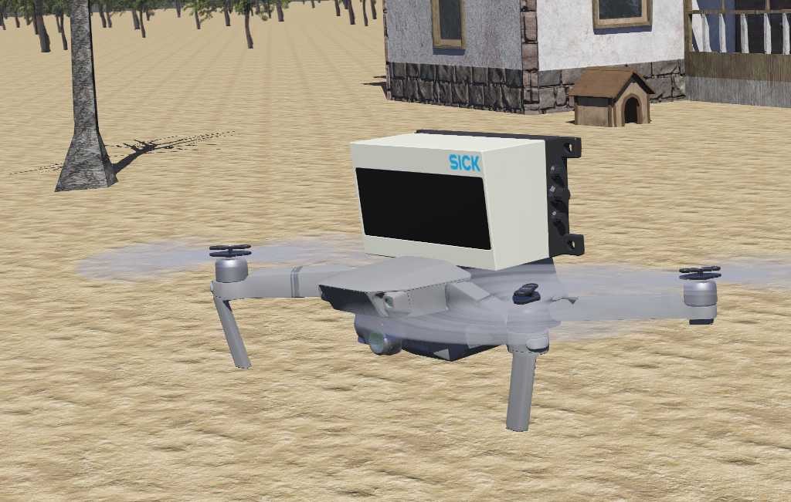
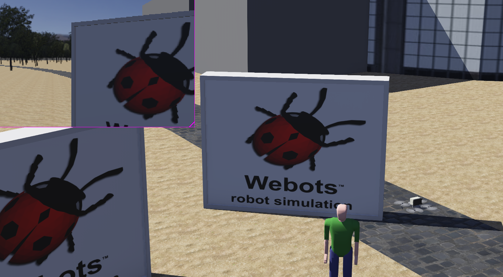
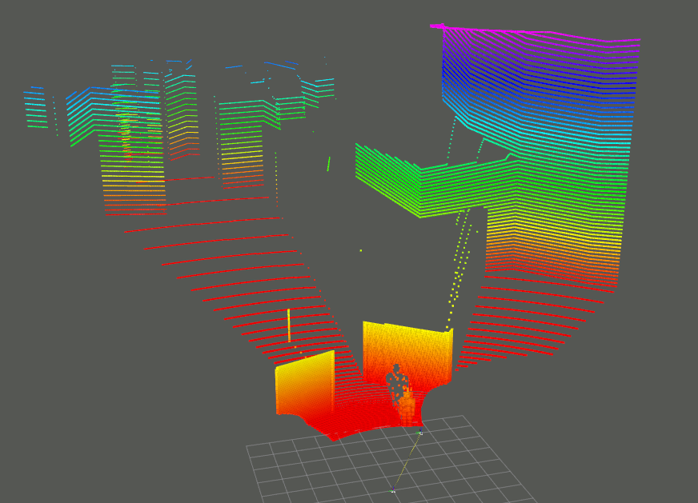

# webots_mav

> Yunfan REN
>
> renyunfan@outlook.com

This is a ROS package that follows the GPL3 open source protocol, which implements webots-based UAV fixed-point control and speed control, wit high density point-cloud.

# History

```diff
+ 2020-12-26: First commit.
+ 2021-02-19: Add velocity control.
+ 2021-02-19: Add a package joy2twist so you can control the mav with joysticks
```



# Build & Usage

## Dependencies

```bash
sudo apt-get install ros-melodic-mavros*
```

> If you are using zsh, you may face the `*` operator cannot work. 
>
> Don't worry, just add a line in` ~/.zshrc`
>
> ```cpp
> setopt no_nomatch
> ```
>
> and `source` it.

## Build

Clone this package to your `catkin_ws` and `catkin_make` it.

```bash
mkdir -p catkin_ws/src
cd catkin_ws/src
git clone https://github.com/RENyunfan/webots_mav.git
cd ..
catkin_make
```

## Usage

Open a terminal, type

```bash
sudo ln -s /opt/ros/melodic/lib/* /usr/local/lib    
sudo ldconfig
```

```diff
-Remember to run `roscore` before you start the world.
```


And then run your webots, select the worlds at `./worlds/uav.wbt` and you can see the drone takeoff.



## ROS TOPIC

Now we have two way to control the mav:

### Position control

* Topic name: `/mavros/setpoint_position/local`
* Topic type: `geometry_msgs::PoseStamped`
* Attention: The position `z` should not be less than 0.

### Velocity control

* Topic name: `/mavros/setpoint_velocity/cmd_vel`
* Topic type: `geometry_msgs::TwistStamped`
* Current maximum velocity has been limited to `3m/s`, I will open a parameter to set it in a moment.

## Visualization

Use command below to visualize the point cloud.

```bash
roslaunch flight_controller rviz.launch
```




# TODO

* Limit the desired mav rotation to a reasonable to prevent it from crash.

