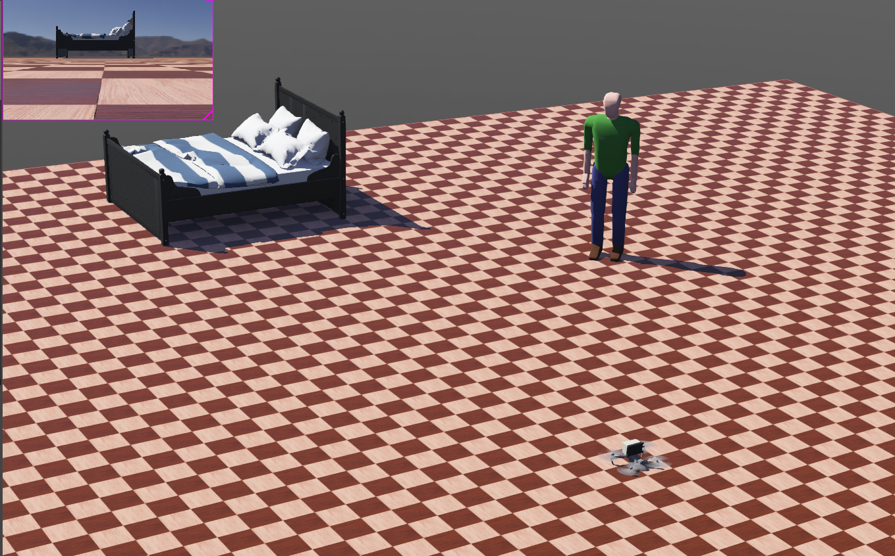
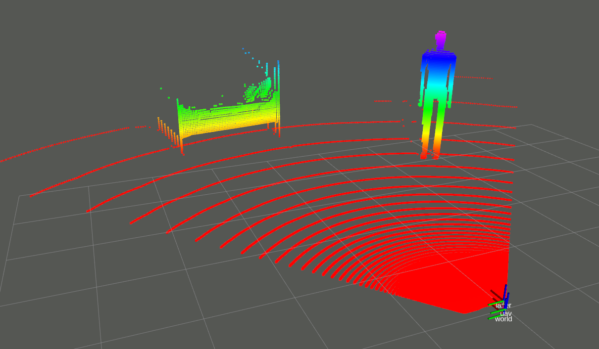

# flight_controller

> Yunfan REN
>
> renyunfan@outlook.com

This is a ROS package that follows the GPL3 open source protocol, which implements webots-based UAV fixed-point control and speed control, wit high density point-cloud.

# History

* 2020/12/16 First commit

# Build & Usage

## Build

Clone this package to your `catkin_ws` and `catkin_make` it.

```bash
mkdir -p catkin_ws/src
cd catkin_ws/src
git clone https://github.com/RENyunfan/webots_mav.git
cd ..
catkin_make
```

## Usage

Open a terminal, type

```bash
LD_PATH_LIB=/opt/ros/melodic/lib
```

 and open your webots in this terminal

```bash
webots
```

Then select the worlds at `./worlds/uav.wbt` and you can see the drone takeoff.



You can use topic `/mavros/setpoint_velocity/cmd_vel` to control the velocity of the uav.

## Visualization

Use command below to visualize the point cloud.

```bash
roslaunch flight_controller rviz.launch
```




# TODO

* Limit the desired mav rotation to a reasonable to prevent it from crash.

